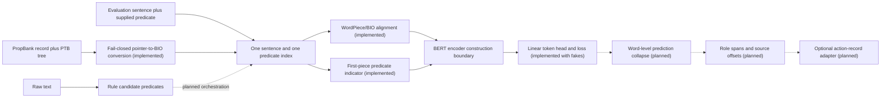

# Semantic Action Extractor

## TL;DR

This project turns short English text into source-grounded predicate–argument records. Its research core is the same task and architecture as Ayo Adetayo's original semantic-role-labeling homework: given a sentence and one supplied predicate, fine-tune BERT to assign word-level PropBank BIO labels such as `ARG0`, `ARG1`, and `ARGM-TMP`.

The repository currently contains a runnable rule baseline and unit-tested SRL primitives for classic/modern PropBank record parsing, Penn Treebank pointer-to-BIO conversion, WordPiece/BIO alignment, BIO repair and decoding, generic micro exact labeled-span scoring, and construction of a predicate-conditioned BERT token classifier. MASC archive integration, word-level prediction collapse, the training and evaluation runner, a checkpoint, and corpus results are pending.

## Abstract

Operational text often names an action, who or what participated, and when or where it happened. This project studies whether explicit predicate conditioning improves a BERT semantic-role model on one lawfully usable public corpus while preserving exact links to the source text.

The controlled research task is PropBank-style semantic role labeling (SRL): one sentence and one known predicate go in; one BIO tag per input word comes out. The neural design uses `bert-base-uncased`, aligns word labels to WordPieces, marks the predicate through BERT token-type IDs, and applies a linear token-classification head. Exact labeled-span precision, recall, and F1 are the principal model metrics. This directly reflects the original homework method; it is not a question-answering formulation.

A planned raw-text product path uses the rule baseline to propose candidate predicates before an SRL model analyzes each candidate. That integration is not implemented yet. Candidate detection and supplied-predicate role labeling will be evaluated separately so end-to-end results cannot hide errors from either stage.

## Example product output

Input:

```text
Maya emailed the signed contract to Jordan on Tuesday.
```

Abridged output:

```json
{
  "actions": [
    {
      "actor": {"text": "Maya", "start": 0, "end": 4},
      "predicate": {"text": "emailed", "start": 5, "end": 12},
      "predicate_lemma": "email",
      "patient": {"text": "the signed contract", "start": 13, "end": 32},
      "qualifiers": [
        {"relation": "to", "value": {"text": "Jordan", "start": 36, "end": 42}},
        {"relation": "on", "value": {"text": "Tuesday", "start": 46, "end": 53}}
      ]
    }
  ]
}
```

The current rule baseline produces this action view. A future neural research representation will retain PropBank roles first. `ARG0` and `ARG1` are predicate-specific roles, not universal synonyms for actor and patient, so any product-facing conversion must be explicit and conservative.

## System design



The design keeps two deliberately separate entry paths:

- **Controlled SRL evaluation:** the dataset supplies the predicate, matching the original homework.
- **Planned raw-text extraction:** the rule baseline proposes predicates, then the SRL component labels each one. This wiring is pending, and candidate recall will be reported separately from role-labeling quality.

## Original method retained

The reengineered neural path preserves the original design decisions:

- `bert-base-uncased` contextual representations;
- one training instance per sentence–predicate pair;
- word-level PropBank BIO labels;
- WordPiece alignment in which the first piece keeps `B-*` and continuation pieces use `I-*`;
- a predicate indicator passed through `token_type_ids`, set only on the first predicate WordPiece;
- a linear classifier over BERT's token states;
- a model boundary that leaves the encoder and classifier trainable and computes cross-entropy while ignoring special/padding positions;
- exact labeled-span precision, recall, and F1, excluding predicate `V` and continuation `C-V` spans;
- token accuracy as a diagnostic, never the main quality claim.

These primitives are a partial modular reimplementation, not a trained pipeline. Restricted course files, starter code, assignment text, checkpoints, and examples are not included.

## Public research data

[Universal Proposition Bank 1.0 English EWT](https://github.com/UniversalPropositions/UP-1.0/tree/master/UP_English-EWT) has been rejected for the restored BIO-span milestone. It supplies dependency-head arguments, not the gold argument spans required by this project's word-level target; the [UP 2.0 paper](https://aclanthology.org/2022.lrec-1.181/) explicitly identifies that limitation.

The next feasibility candidate is the [88K-word MASC PropBank release](https://anc.org/data/masc/downloads/data-download/), which is advertised with original PropBank pointers and the Penn Treebank parses they reference. MASC is **not yet selected for training or downloaded**. A source-neutral, fail-closed pointer conversion core now exists with invented tests; MASC file discovery, joins, provenance allowlisting, coverage audit, and document-disjoint split protocol remain behind the recorded gate.

The conversion core parses the documented classic and later English `.prop` record layouts, counts PTB empty terminals during pointer resolution, removes them only from the model-facing word sequence, preserves discontinuous pieces, treats `LINK-*` as metadata, retains the raw record and terminal-to-word map, and rejects an entire predicate instance when one gold role cannot be represented faithfully. It produces a validated unsplit record so document-level splits can be frozen later. `wsj_*` basenames are denied by default as a rights backstop; a future MASC adapter must add the stricter provenance-reviewed allowlist. Rejections carry stable reason codes so a corpus audit can reconcile every input row without turning failed arguments into false `O` labels.

No research corpus is downloaded or vendored by the current package. The decision record and pass/fail gate are documented in [DATA_USAGE.md](DATA_USAGE.md) and [docs/datasets/masc_propbank_gate.md](docs/datasets/masc_propbank_gate.md).

## Evaluation contracts

The project reports distinct measures for distinct claims:

| Contract | What it measures | Status |
| --- | --- | --- |
| Predicate-candidate recall | Whether the raw-text front end proposed each annotated predicate | Detector implemented; corpus evaluator pending |
| Generic exact labeled-span P/R/F1 | Whether predicted BIO spans match gold label and boundary exactly | Implemented for word-level BIO sequences; no corpus result |
| Per-role F1 | Which PropBank roles improve or fail | Not implemented |
| Token accuracy | Word-label diagnostic dominated by `O` labels | Not implemented; planned diagnostic |
| End-to-end frame F1 | Combined candidate detection and downstream role extraction from raw text | Not implemented |
| Latency and memory | Practical cost of baseline and neural inference | Not benchmarked |

Unit tests establish software behavior, not model accuracy. The earlier course run used restricted data and is not reported as a result for this public repository.

## Research plan

| Study | Purpose | Status |
| --- | --- | --- |
| E0 — Rule baseline | Establish a runnable product interface, exact source offsets, and candidate proposer | Baseline, API, and CLI implemented; corpus and latency evaluation pending |
| E1 — SRL foundation | Restore BIO alignment, supplied-predicate conditioning, public-data selection, adaptation, and exact role scoring | In progress: source-neutral conversion and SRL primitives implemented; MASC acquisition audit and archive adapter pending |
| E2 — Public neural reproduction | Fine-tune the original BERT architecture on a frozen, predeclared public split and report multiple seeds | Not started |
| E3 — Bounded analysis | Compare the original predicate signal with no signal, then report errors and systems costs | Not started |

E2 will not begin until E1 is reviewed. No public result, checkpoint, or benchmark claim exists yet.

## Scope and limitations

- PropBank roles describe relationships relative to a predicate sense; they do not provide a universal actor/patient ontology.
- MASC is a candidate, not an adopted dependency; no corpus-backed claim exists until its feasibility gate passes.
- The controlled model assumes a supplied predicate. Raw-text candidate detection is a separate source of error.
- The rule baseline is English-specific and works best on short active clauses.
- The system does not resolve coreference, implicit arguments, intent, task ownership, completion state, or legal/business meaning.
- A future checkpoint will fine-tune a pretrained encoder; this project does not pretrain a foundation model.
- Representative authorized domain data is required before any operational-readiness claim.

## Documentation

- [PROJECT_SPEC.md](PROJECT_SPEC.md) defines the research question, hypotheses, experiments, and stopping rules.
- [DATA_USAGE.md](DATA_USAGE.md) records data rights and the public-data boundary.
- [MODEL_CARD.md](MODEL_CARD.md) documents current and planned model behavior.
- [reports/results.md](reports/results.md) separates software evidence from empirical results.
- [reports/error_analysis.md](reports/error_analysis.md) defines the error-analysis taxonomy.

## License

Original repository code is MIT licensed. That license does not apply automatically to datasets, pretrained models, or other third-party artifacts. If MASC is adopted, its license, attribution, source-text lineage, and any checkpoint obligations will remain separate.

## Run the project

Python 3.11 or newer is required.

Install and run the dependency-free baseline:

```bash
python -m pip install -e .
semantic-action-extractor --pretty "Maya emailed the signed contract to Jordan on Tuesday."
```

The CLI also accepts standard input or a UTF-8 file:

```bash
echo "The support team escalated the incident to Priya." | semantic-action-extractor --pretty
semantic-action-extractor --input-file examples/sample_input.txt --pretty
```

Use the Python API:

```python
from semantic_action_extractor import RuleBasedExtractor

result = RuleBasedExtractor().extract(
    "The support team escalated the incident to Priya."
)
print(result.to_dict())
```

Run the complete dependency-free test suite:

```bash
PYTHONPATH=src python -m unittest discover -s tests -v
```

Neural training commands will be added only when the E2 training pipeline and public-data preparation are complete; the repository does not advertise a command that cannot yet reproduce a result.
