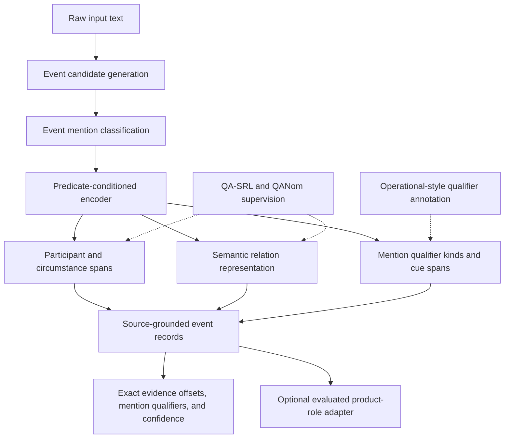
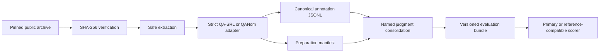

# Semantic Action Extractor

A research system for source-grounded event and information extraction across verbal and nominal predicates.

## TL;DR

Semantic Action Extractor is designed to turn unstructured English into structured, evidence-linked event records: the event mention, connected participants or circumstances, exact supporting spans, source-grounded mention qualifiers, and confidence. QA-SRL questions are the project’s internal role representation and evaluation target, not a user-facing question-answering interface.

- The implemented foundation includes the dependency-free rule baseline, pinned archive tools, strict QA-SRL and QANom adapters, deterministic manifests, split-leakage controls, reusable evaluation bundles, and three versioned scorer contracts.
- Every selected QA-SRL and QANom release file has been processed successfully, and the adapters reproduce the release-computed counts documented in this repository.
- A cross-task split check found copied evaluation sentences under different upstream IDs; the fixed training policy quarantines 120 of 44,477 QA-SRL sentences and 28 of 7,114 QANom sentences at the document level.
- QA-SRL and QANom provide training and evaluation supervision across actions expressed as verbs (`approved`) and event-expressing nouns (`approval`); they are not presented as the product interface.
- The main model will select participant, circumstance, and qualifier-cue spans directly from the input, predict the seven constrained parts of each QA-SRL role label, and support a separately evaluated projection into simpler product-facing fields.
- The research comparison is a structured BERT-family encoder versus a reproduced T5-small QASem generator under matched data and compute.
- No neural checkpoint or corpus-level result is claimed yet.

## Abstract

Operational text describes consequential events without presenting them as structured data. A support note might say that an agent approved a refund, a meeting summary might record the team’s approval, and an email might describe a customer’s cancellation. The same event can appear as a verb or as a nominalization—a noun derived from a verb—so verb-only information extraction misses part of the record.

The practical task is structured event and information extraction from raw text. QA-SRL and QANom provide an interpretable supervision format in which natural-language questions label semantic relationships and answers are exact source spans; no user must formulate those questions at inference time.

Prior QASem research demonstrated that a text-to-text model can jointly generate verbal and nominal question-answer semantics. This project studies a different engineering and research question: whether a source-constrained encoder can preserve that semantic coverage while improving exact grounding, confidence measurement, inference efficiency, and transfer to unseen predicate families and operational-style language.

The complete target system detects event predicates in raw text, selects participant and circumstance spans from the source, and uses the seven QA-SRL question slots internally to learn their semantic relationships. Evaluation separates supplied-predicate extraction from the raw-text pipeline and compares the structured encoder with a reproduced T5-small QASem baseline.

## Problem definition

A **predicate** expresses an action or event. An **argument** is a participant or circumstance connected to that predicate. A **role question** is the internal QA-SRL label that expresses the connection in natural language.

Consider:

```text
After Priya’s approval of the refund, Jordan emailed the customer on Tuesday.
```

The target system identifies two predicates:

1. `approval`, a nominal predicate whose related verbal form is `approve`;
2. `emailed`, a verbal predicate whose lemma is `email`.

It then connects `Priya` and `the refund` to `approval`, and `Jordan`, `the customer`, and `Tuesday` to `emailed`. Each answer remains a span of the original sentence rather than newly generated text.

An abridged research-facing target record is:

```json
{
  "predicate": {"text": "approval", "start": 14, "end": 22},
  "predicate_lemma": "approval",
  "related_verbal_form": "approve",
  "predicate_type": "nominal",
  "mention_qualifiers": [],
  "arguments": [
    {
      "role": "who approved something?",
      "role_scheme": "qa_srl",
      "span": {"text": "Priya", "start": 6, "end": 11}
    },
    {
      "role": "what was approved?",
      "role_scheme": "qa_srl",
      "span": {"text": "the refund", "start": 26, "end": 36}
    }
  ]
}
```

The role question preserves what the annotation supports instead of forcing every span into `actor` or `patient`. In `Jordan received the invoice`, Jordan is a recipient even though Jordan appears before the predicate. In `The contract was approved by Maya`, Maya is the approver even though Maya appears after it. A separately evaluated product-facing adapter may project these richer labels into fields such as `who`, `what`, `when`, and `where`; that lossy mapping is not treated as equivalent to the research annotation.

The term *action* here means a linguistic action or event mention. The system does not determine whether something is an assignment, commitment, action item, completed task, or instruction to execute. A mention can carry exact cue-backed qualifiers such as `negated`, `possible`, `planned`, or `reported`; those labels describe how the source presents the mention and never establish that it occurred.

## Prior research and our contribution

The industry-facing problem is source-grounded event and information extraction. QA-SRL and QANom are used as supervision because they provide broad predicate coverage, interpretable relationships, and exact source spans—not because the intended product is a general QA system.

[Large-Scale QA-SRL Parsing](https://aclanthology.org/P18-1191/) defined two learned problems for each supplied verbal predicate: find its answer spans and generate the constrained question that labels each relationship. [QANom](https://aclanthology.org/2020.coling-main.274/) extended the representation to event-expressing nouns.

[QASem Parsing](https://aclanthology.org/2022.emnlp-main.528/) subsequently trained a unified T5 model over QA-SRL and QANom. It already studied joint learning, target-predicate markers, output ordering, and source-domain transfer. This project treats that work as a baseline rather than presenting unified parsing as a new result.

The planned contribution is:

1. **Structured versus generative modeling:** Compare a span-and-question encoder with a text-to-text QASem parser under matched inputs and compute.
2. **By-construction evidence grounding:** Select evidence from source positions and measure malformed or ungrounded generations from the comparison model.
3. **Predicate-conditioning study:** Compare no signal, BERT token types, boundary markers, and learned predicate features.
4. **Controlled transfer:** Measure naturally unseen and deliberately held-out predicate families, source-domain shift, and operational-style language.
5. **Complete-pipeline accounting:** Separate candidate generation, predicate classification, mention qualification, supplied-predicate extraction, and raw-text end-to-end results.
6. **Engineering evidence:** Report calibration, latency, throughput, memory, checkpoint size, and exact reproducibility metadata.

## Research question

> Under matched data and compute, how does a source-constrained event extractor trained with QA-SRL and QANom supervision compare with a generative QASem parser on labeled extraction quality, exact source grounding, calibration, efficiency, and transfer to unseen predicates and operational-style text—and which predicate-conditioning method is most robust?

The principal hypotheses are that structured span selection will make returned evidence source-valid by construction; explicit predicate signals will outperform no signal; marker or learned-feature conditioning will transfer better than repurposed token types; and balanced joint training will help nominal predicates without reducing verbal labeled F1 by more than one point.

## System design



QA-SRL and QANom enter through the dashed training and evaluation path. At inference, the system receives raw text rather than a user-supplied question. This raw-text system contains four separately measured decisions. Candidate generation proposes possible verbs and nouns. Predicate classification determines which candidates express in-scope events; for QANom nouns, this includes deciding whether the noun is **eventive**, meaning that it actually describes an event in that sentence. Mention qualification identifies supported linguistic framing and its exact cues without inferring occurrence or workflow status. Argument extraction then analyzes one positive predicate at a time. Supplying the correct predicate is useful for component diagnosis but cannot stand in for the complete-pipeline result.

The structured neural parser uses one contextual encoder with three learned outputs. The argument-span head finds answer boundaries in the source. The question head predicts the seven constrained QA-SRL slots—such as the question word, auxiliary, subject placeholder, verb form, object placeholders, and preposition—and code deterministically realizes the final question. The mention-qualifier head predicts controlled framing labels and selects their cue evidence from the same source. Several spans can remain grouped under one role question or one qualifier through explicit grouped evidence.

The T5-small QASem comparison generates the complete question-answer set as text. Its outputs are aligned back to the source, and invalid, duplicate, or ungrounded answers remain measured errors.

The current rule baseline exercises the same public interface but is not a learned semantic parser. It identifies configured verbs and returns nearby surface text. Roles such as `before_predicate` describe position only, not semantic meaning.

The public schema distinguishes an unassessed qualifier field from an assessed empty list. Every populated qualifier has a controlled kind and one or more exact source spans. The rule baseline attaches conservative lexical cues; trained systems and the operational-style challenge set must evaluate qualifier scope separately.

| Component | Current baseline | Research target |
| --- | --- | --- |
| Predicate coverage | Configured verbs | Verbal and eventive nominal predicates |
| Arguments | Surface position and prepositions | Grounded participant and circumstance spans with QA-SRL supervision |
| Mention qualifiers | Conservative lexical cues with exact offsets | Predicate-local qualified-mention labels and grounded cue spans |
| Learning | None | Fine-tuned encoder and comparison generator |
| Score | Heuristic completeness | Separately calibrated predicate and argument probabilities |
| Evaluation | Software behavior | Multi-seed extraction, transfer, calibration, and systems study |

The implemented research-data path is separate from the future neural architecture:



## Data and representation

These corpora provide research supervision and benchmark views; they are not the serving interface. The verbal training source is QA-SRL Bank 2.1, with QA-SRL Gold Standard used for primary verbal development and test evaluation. QANom supplies nominal candidates, contextual eventivity labels, related verbal forms, role questions, and answer spans.

Dataset preparation uses an evidence-preserving canonical representation that retains source identifiers, tokens, official splits, verb-inflection paradigms, all seven question slots, question and answer provenance, available tense/aspect/voice/negation fields, multiple judgments, alternative or grouped spans, negative nominal candidates, and optional predicate-local mention qualifiers. QA-SRL and QANom do not supply complete qualifier supervision, so their adapter records remain unassessed rather than receiving invented labels. The adapter normalizes empty slots to `_`, reconstructs canonical space-separated text from release tokens, counts exact duplicate QANom rows once, and records discarded release-only columns and upstream anomalies in the manifest. The public inference response remains smaller because serving output and training evidence have different requirements.

QANom development and test sentences intentionally overlap QA-SRL Gold Standard source material within the same evaluation role. A release-wide comparison found no development-to-test identity overlap, but it found 11 exact sentence texts copied from training material into the selected development or test protocol under different source and document IDs. The fixed `cross-role-document-quarantine-v1` policy preserves evaluation unchanged and excludes every training sentence from the seven affected training documents across both tasks.

The operational-style challenge set will be authored or explicitly licensed, annotated, adjudicated, and frozen before model comparisons use it. A versioned [pilot protocol](docs/challenge_set/protocol.md), [annotation guide](docs/challenge_set/annotation_guide.md), [rights template](docs/challenge_set/source_notice_template.md), and [20-record workbook](docs/challenge_set/pilot_worksheets.xlsx) are now prepared; no pilot note has been accepted yet. Without a second human annotator, the pilot can refine the guide but E1 cannot be called independently annotated, adjudicated, or frozen. Unless representative real operational text is available, the report will not describe it as proof of operational-domain performance.

## Evaluation

The primary research extraction measure is labeled QA-pair F1: a prediction must identify an answer with token intersection-over-union of at least `0.5` and assign the same seven-slot role question. Unlabeled F1 shows whether the system found the right answer even when its question was wrong, while exact token-span and exact character-span F1 require identical boundaries. Exact source validity measures whether every returned answer truly maps to the original text. Candidate, predicate, and raw-text record metrics are reported separately so a supplied-predicate score is never presented as end-to-end system quality.

The scorer-ready gold view uses `valid-judgment-union-v1`. Raw judgments remain preserved; a question enters the evaluation view when at least one judgment marks it valid, and distinct answer alternatives from valid judgments are unioned. Exact duplicates count once. A retained valid judgment with no answer is counted but does not create an invented span, and questions attached to an upstream non-eventive nominal remain recorded as anomalies without becoming gold QA pairs.

Three named scoring contracts prevent prior-work comparison from being confused with the project’s main result. `primary-end-to-end-v1` evaluates the union of gold and predicted predicate keys, uses maximum-cardinality then maximum-IoU matching, and charges missed or spurious predicates to downstream counts. `qasrl-gs-compatible-v1` uses the Gold Standard predicate scope, inclusive `0.5` overlap, and a frozen five-field question-equivalence rule; it is compatible with the checked reference but is not claimed as byte-for-byte official because that revision is missing a callable dependency. `qanom-reference-v1` preserves QANom’s inner join, strict overlap greater than `0.3`, greedy span-value matching, coarse roles, role alignment, and omission of argument counts when eventivity disagrees.

When gold challenge predicates contain qualifier annotation, the primary scorer also reports `mention-qualifier-label-and-exact-evidence-v1`: one F1 score for qualifier kinds and another for the exact grouped token and character spans supporting them. The two reference-compatible modes remain unchanged and return no qualifier metric.

The complete-system report will lead with raw-text event detection and grounded relation extraction under `primary-end-to-end-v1`; the QA-specific views remain dataset-aligned diagnostics and prior-work comparators.

Candidate detection and contextual eventivity are separate metrics: an unbounded prediction-only candidate cannot be counted as an eventivity true negative. Calibration evaluates predicate confidence against predicate correctness and argument confidence against complete matched question-answer correctness; one ambiguous overall score is not used for every purpose. Latency, throughput, peak memory, and checkpoint size show whether accuracy improvements are practical.

Every neural comparison uses at least three paired seeds and reports the mean and sample standard deviation. Joint and separate systems receive equal primary training tokens or optimizer steps. The verbal task has a declared one-point non-inferiority margin so a nominal improvement cannot conceal a larger verbal regression.

## Research plan

| Study | Purpose | Status |
| --- | --- | --- |
| E0: Software and rule baseline | Establish the interface, deterministic lower bound, and error taxonomy. | Implemented; corpus evaluation pending. |
| E1: Annotation, scorer, and challenge-set layer | Preserve QA-SRL/QANom evidence, reproduce metrics, and freeze operational-style evaluation. | Adapters, manifests, scans, quarantine, bundles, scorer contracts, qualifier schema, and pilot materials implemented; authored and independently annotated challenge data pending. |
| E2: QASem reproduction | Establish the T5-small generative comparison on the verified preparation. | Pending. |
| E3: Structured verbal parser | Train span detection and seven-slot question prediction on verbal QA-SRL. | Pending. |
| E3.5: Verbal raw-text vertical slice | Connect a simple verbal candidate layer to the trained parser and measure evidence-linked output, stage errors, and latency before the broader ablations. | Pending. |
| E4: Predicate conditioning | Compare no signal, token types, markers, and learned features with matched runs. | Pending. |
| E5: Verbal and nominal training | Compare separate, natural-ratio joint, and balanced joint training at equal compute. | Pending. |
| E6: Complete pipeline | Extend the vertical slice to full verbal and nominal candidate generation plus predicate/eventivity classification. | Pending. |
| E7: Generalization and systems | Test held-out families, domains, operational-style text, calibration, and efficiency. | Pending. |

## Results status

The current evidence establishes data-pipeline and software behavior only. The complete suite contains 115 tests covering schema validation, exact grounding, mention-qualifier cues, archive verification and safe extraction, atomic artifact publication, strict adapter behavior, canonical JSONL round trips, manifest determinism, source-change detection, split leakage, document quarantine, consolidation anomalies, matching boundaries, question equivalence, scorer contracts, reusable evaluation bundles, and all three CLIs.

Full scans of every selected release file reproduce the documented QA-SRL and QANom record, candidate, question, and judgment counts. They also preserve and report one QA-SRL valid judgment with no answer span; 24 exact duplicate QANom training QA rows; 57 QANom development eventivity/question conflicts; one reconstructed missing QANom development answer string; case-normalized noun fields; and 1,141 nonempty values from the accidental QANom test index column. These are preparation findings, not model-quality results.

No dataset score, trained model comparison, checkpoint, or operational-readiness claim is available yet.

## Research conclusions

*Status: TK after the complete multi-seed study.*

### Answer to the primary research question

TK: State whether the structured parser improves grounding, quality, calibration, or efficiency relative to the reproduced QASem baseline, and identify the strongest predicate-conditioning method.

### Results at a glance

| System | Verbal labeled F1 | Nominal labeled F1 | Exact grounding | p50 latency | Conclusion |
| --- | ---: | ---: | ---: | ---: | --- |
| Rule baseline | N/A | N/A | TK | TK | TK |
| QASem T5-small reproduction | TK | TK | TK | TK | TK |
| Structured verbal model | TK | N/A | TK | TK | TK |
| Structured joint model | TK | TK | TK | TK | TK |

### Structured versus generative finding

TK: Compare labeled quality, ungrounded or malformed output, calibration, latency, memory, and characteristic errors.

### Predicate-conditioning finding

TK: Compare no signal, token types, boundary markers, and learned predicate features under one controlled protocol.

### Joint-training finding

TK: Quantify nominal transfer and paired verbal change under equal compute and the declared non-inferiority margin.

### Generalization finding

TK: Report naturally unseen and controlled held-out predicate families, size-matched source-domain transfer, and the frozen operational-style set.

### Practical recommendation

TK: Translate quality, latency, model size, confidence behavior, and failure patterns into a bounded recommendation for a real application.

### Unexpected and negative findings

TK: Preserve failed hypotheses, regressions, and implementation limitations rather than reporting only the strongest result.

Planned figures include structured-versus-generative quality and grounding, verbal-versus-nominal performance, the joint-training effect, held-out-family gaps, confidence risk–coverage curves, and the quality–latency tradeoff.

## Business application

A support organization could apply the extractor to a note such as `After Priya’s approval of the refund, Jordan emailed the customer on Tuesday.` The returned records could populate a searchable case timeline or suggest structured event fields in an internal tool. `Priya`, `the refund`, `Jordan`, `the customer`, and `Tuesday` remain linked to the exact words in the note, allowing another system or person to inspect the evidence instead of trusting an unsupported summary. The product-facing view can expose concise fields while retaining the richer QA-SRL labels for research, auditing, or error analysis.

The research datasets do not establish performance on a company’s tickets, email, or meeting notes. A production use would require representative authorized examples, domain testing, and an application-specific error policy. The extractor does not autonomously execute work or make consequential decisions.

## Limitations and next research steps

- The current extraction baseline covers configured verbs only and does not detect nominal predicates.
- Surface roles describe location, not semantic meaning.
- The baseline attaches conservative lexical mention qualifiers but does not reliably resolve their scope, passive voice, coordination, coreference, implicit arguments, or predicate senses.
- QA-SRL and QANom use research domains rather than real operational notes.
- The operational-style pilot materials exist, but the notes are not yet authored or independently annotated and no scored set is adjudicated or frozen, so E1 is not complete.
- Supplied-predicate extraction is only a component evaluation; the raw-text candidate and classification stages are required for any complete-system claim.
- The optional product-facing role adapter is not yet implemented or evaluated.
- The neural study fine-tunes pretrained models; it does not pretrain a foundation model from random weights.
- QA-SRL question-equivalence metrics are imperfect and require both automatic and targeted qualitative analysis.
- The action schema does not represent assignment, commitment, due dates, completion state, or workflow execution.

## Data, sources, and license

- [DATA_USAGE.md](DATA_USAGE.md) records the current data boundaries.
- [MODEL_CARD.md](MODEL_CARD.md) documents the deterministic baseline.
- [PROJECT_SPEC.md](PROJECT_SPEC.md) contains the complete experimental contract.
- [LICENSE](LICENSE) applies to the repository’s original code, not automatically to third-party datasets or checkpoints.

The predecessor BERT notebook used restricted course-provided OntoNotes-derived data. This project carries forward engineering concepts such as WordPiece alignment, predicate conditioning, token classification, decoding, and span evaluation, but does not publish the restricted corpus or use its recorded results as evidence.

## How to run the project

### Install the project

Install Python 3.11 through 3.14. From the repository root:

```bash
python -m pip install -e .
```

### Extract the current rule-baseline output

```bash
semantic-action-extractor --pretty \
    "Maya emailed the signed contract to Jordan on Tuesday."
```

The baseline reports source-grounded surface arguments. It does not attach QA-SRL role questions or detect nominal predicates.

The CLI also accepts standard input or a UTF-8 file:

```bash
echo "The support team escalated the incident to Priya." \
    | semantic-action-extractor --pretty
semantic-action-extractor \
    --input-file examples/sample_input.txt \
    --pretty
```

### Use the Python API

```python
from semantic_action_extractor import RuleBasedExtractor

result = RuleBasedExtractor().extract(
    "The support team escalated the incident to Priya."
)
print(result.to_dict())
```

### Configure the rule baseline

```bash
semantic-action-extractor \
    --config configs/baseline.toml \
    --pretty \
    "The operator triaged the alert."
```

The `min_score` value filters the baseline’s completeness heuristic. It is not a calibrated correctness probability.

### Prepare the verified research data

Create local-only directories, then fetch and safely extract the three pinned archives:

```bash
mkdir -p data/raw data/extracted data/processed

semantic-action-data fetch \
    qa-srl-bank-2.1 \
    data/raw/qasrl-v2_1.tar
semantic-action-data fetch \
    qa-srl-gold-standard \
    data/raw/qasrl-gs.tar
semantic-action-data fetch \
    qanom-2020 \
    data/raw/qanom_dataset.zip

semantic-action-data extract \
    qa-srl-bank-2.1 \
    data/raw/qasrl-v2_1.tar \
    data/extracted/qasrl-bank
semantic-action-data extract \
    qa-srl-gold-standard \
    data/raw/qasrl-gs.tar \
    data/extracted/qasrl-gold
semantic-action-data extract \
    qanom-2020 \
    data/raw/qanom_dataset.zip \
    data/extracted/qanom
```

`fetch` verifies SHA-256 before publishing a download. For an archive obtained separately, `semantic-action-data verify ARTIFACT PATH` checks it against the same pinned identity. Raw archives, extracted data, and processed JSONL stay outside Git.

Build the fixed cross-task quarantine report before preparing either training split:

```bash
semantic-action-data check-joint-splits \
    --qasrl-train data/extracted/qasrl-bank/qasrl-v2_1/expanded/train.jsonl.gz \
    --qasrl-index data/extracted/qasrl-bank/qasrl-v2_1/index.json.gz \
    --qasrl-gold-dev data/extracted/qasrl-gold/qasrl-gs/dev.jsonl.gz \
    --qasrl-gold-test data/extracted/qasrl-gold/qasrl-gs/test.jsonl.gz \
    --qanom-train data/extracted/qanom/annot.train.csv \
    --qanom-dev data/extracted/qanom/annot.dev.csv \
    --qanom-test data/extracted/qanom/annot.test.csv \
    --output data/processed/training-quarantine.json
```

Adapt the verbal and nominal training sources with that report. Each command writes canonical annotation JSONL plus a sibling manifest containing input hashes, counts, exclusions, anomaly counts, schema versions, and the output fingerprint.

```bash
semantic-action-data adapt-qasrl \
    data/extracted/qasrl-bank/qasrl-v2_1/expanded/train.jsonl.gz \
    data/processed/qasrl-expanded-train.jsonl \
    --release 2.1 \
    --split train \
    --layer expanded \
    --index data/extracted/qasrl-bank/qasrl-v2_1/index.json.gz \
    --quarantine-report data/processed/training-quarantine.json

semantic-action-data adapt-qanom \
    data/extracted/qanom/annot.train.csv \
    data/processed/qanom-train.jsonl \
    --split train \
    --quarantine-report data/processed/training-quarantine.json
```

An adapted file can be revalidated or converted into a reusable scorer-ready gold bundle:

```bash
semantic-action-data validate-adapted \
    data/processed/qanom-train.jsonl \
    --manifest data/processed/qanom-train.jsonl.manifest.json

semantic-action-data consolidate \
    data/processed/qanom-train.jsonl \
    data/processed/qanom-train-gold.json \
    --manifest data/processed/qanom-train.jsonl.manifest.json
```

### Score an evaluation bundle

Once a model emits a prediction bundle with the same versioned format, score it against a consolidated gold bundle:

```bash
semantic-action-evaluate \
    data/processed/qanom-test-gold.json \
    outputs/qanom-test-predictions.json \
    --mode primary-end-to-end-v1 \
    --output reports/qanom-test-score.json
```

Use `qasrl-gs-compatible-v1` or `qanom-reference-v1` only for the corresponding prior-work comparison. The project’s main end-to-end claim uses `primary-end-to-end-v1`.

### Run the tests

```bash
PYTHONPATH=src python -m unittest discover -s tests -v
```
