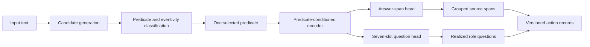

# Semantic Action Extractor

A research system for source-grounded verbal and nominal semantic role extraction.

## TL;DR

Semantic Action Extractor turns unstructured English into records of actions and events: the predicate, the people or things connected to it, the semantic question describing each connection, and the exact supporting text.

- The current implementation is a dependency-free rule baseline with exact source offsets, a versioned JSON response, a CLI, and automated tests.
- The trained system will use QA-SRL and QANom to cover actions expressed as verbs (`approved`) and event-expressing nouns (`approval`).
- The main model will select answer spans directly from the input and predict the seven constrained parts of each QA-SRL role question.
- The research comparison is a structured BERT-family encoder versus a reproduced T5-small QASem generator under matched data and compute.
- No neural checkpoint or corpus-level result is claimed yet.

## Abstract

Operational text describes consequential events without presenting them as structured data. A support note might say that an agent approved a refund, a meeting summary might record the team’s approval, and an email might describe a customer’s cancellation. The same event can appear as a verb or as a nominalization—a noun derived from a verb—so verb-only extraction misses part of the record.

Prior QASem research demonstrated that a text-to-text model can jointly generate verbal and nominal question-answer semantics. This project studies a different engineering and research question: whether a source-constrained encoder can preserve that semantic coverage while improving exact grounding, confidence measurement, inference efficiency, and transfer to unseen predicate families and operational-style language.

The proposed model first selects answer spans from the source and then predicts the seven structured slots that form a QA-SRL question. It is compared with a reproduced T5-small QASem baseline, multiple target-predicate signals, separate and balanced joint training, and a complete pipeline that must find predicates before extracting their arguments.

## Problem definition

A **predicate** expresses an action or event. An **argument** is a participant or circumstance connected to that predicate. A **role question** expresses the connection in natural language.

Consider:

```text
After Priya’s approval of the refund, Jordan emailed the customer on Tuesday.
```

The target system identifies two predicates:

1. `approval`, a nominal predicate whose related verbal form is `approve`;
2. `emailed`, a verbal predicate whose lemma is `email`.

It then connects `Priya` and `the refund` to `approval`, and `Jordan`, `the customer`, and `Tuesday` to `emailed`. Each answer remains a span of the original sentence rather than newly generated text.

An abridged target record is:

```json
{
  "predicate": {"text": "approval", "start": 14, "end": 22},
  "predicate_lemma": "approval",
  "related_verbal_form": "approve",
  "predicate_type": "nominal",
  "arguments": [
    {
      "role": "who approved something?",
      "role_scheme": "qa_srl",
      "span": {"text": "Priya", "start": 6, "end": 11}
    },
    {
      "role": "what was approved?",
      "role_scheme": "qa_srl",
      "span": {"text": "the refund", "start": 26, "end": 36}
    }
  ]
}
```

The role question preserves what the annotation supports instead of forcing every span into `actor` or `patient`. In `Jordan received the invoice`, Jordan is a recipient even though Jordan appears before the predicate. In `The contract was approved by Maya`, Maya is the approver even though Maya appears after it.

The term *action* here means a linguistic action or event mention. The system does not determine whether something is an assignment, commitment, action item, completed task, or instruction to execute.

## Prior research and our contribution

[Large-Scale QA-SRL Parsing](https://aclanthology.org/P18-1191/) defined two learned problems for each supplied verbal predicate: find its answer spans and generate the constrained question that labels each relationship. [QANom](https://aclanthology.org/2020.coling-main.274/) extended the representation to event-expressing nouns.

[QASem Parsing](https://aclanthology.org/2022.emnlp-main.528/) subsequently trained a unified T5 model over QA-SRL and QANom. It already studied joint learning, target-predicate markers, output ordering, and source-domain transfer. This project treats that work as a baseline rather than presenting unified parsing as a new result.

The planned contribution is:

1. **Structured versus generative modeling:** Compare a span-and-question encoder with a text-to-text QASem parser under matched inputs and compute.
2. **Guaranteed answer grounding:** Select answers from source positions and measure malformed or ungrounded generations from the comparison model.
3. **Predicate-conditioning study:** Compare no signal, BERT token types, boundary markers, and learned predicate features.
4. **Controlled transfer:** Measure naturally unseen and deliberately held-out predicate families, source-domain shift, and operational-style language.
5. **Complete-pipeline accounting:** Separate candidate generation, predicate classification, supplied-predicate extraction, and raw-text end-to-end results.
6. **Engineering evidence:** Report calibration, latency, throughput, memory, checkpoint size, and exact reproducibility metadata.

## Research question

> Under matched data and compute, how does a source-constrained encoder parser compare with a generative QASem parser on labeled extraction quality, exact source grounding, calibration, efficiency, and transfer to unseen predicates and operational-style text—and which predicate-conditioning method is most robust?

The principal hypotheses are that structured span selection will eliminate ungrounded answer strings; explicit predicate signals will outperform no signal; marker or learned-feature conditioning will transfer better than repurposed token types; and balanced joint training will help nominal predicates without reducing verbal labeled F1 by more than one point.

## System design



The complete system contains three separately measured decisions. Candidate generation proposes possible verbs and nouns. Predicate classification determines which candidates express in-scope events; for QANom nouns, this includes deciding whether the noun is **eventive**, meaning that it actually describes an event in that sentence. Argument extraction then analyzes one positive predicate at a time.

The structured neural parser uses one contextual encoder with two learned outputs. The span head finds answer boundaries in the source. The question head predicts the seven constrained QA-SRL slots—such as the question word, auxiliary, subject placeholder, verb form, object placeholders, and preposition—and code deterministically realizes the final question. Several spans can remain grouped under the same role question through an explicit group identifier in the public response.

The T5-small QASem comparison generates the complete question-answer set as text. Its outputs are aligned back to the source, and invalid, duplicate, or ungrounded answers remain measured errors.

The current rule baseline exercises the same public interface without pretending to solve these learned tasks. It identifies configured verbs and returns nearby surface text. Roles such as `before_predicate` describe position only, not semantic meaning.

| Component | Current baseline | Research target |
| --- | --- | --- |
| Predicate coverage | Configured verbs | Verbal and eventive nominal predicates |
| Arguments | Surface position and prepositions | Source spans with QA-SRL role questions |
| Learning | None | Fine-tuned encoder and comparison generator |
| Score | Heuristic completeness | Separately calibrated predicate and argument probabilities |
| Evaluation | Software behavior | Multi-seed extraction, transfer, calibration, and systems study |

## Data and representation

The verbal training source is QA-SRL Bank 2.1, with QA-SRL Gold Standard used for primary verbal development and test evaluation. QANom supplies nominal candidates, contextual eventivity labels, related verbal forms, role questions, and answer spans.

Dataset preparation uses a lossless research representation that retains source identifiers, tokens, official splits, verb-inflection paradigms, all seven raw question slots, question and answer provenance, available tense/aspect/voice/negation fields, multiple answer judgments, alternative or grouped spans, and negative nominal candidates. The public inference response remains smaller because serving output and training evidence have different requirements.

QANom development and test sentences overlap QA-SRL Gold Standard source material. Joint experiments therefore preserve source identifiers and prevent cross-task document leakage.

The operational-style challenge set is authored or explicitly licensed, annotated, adjudicated, and frozen before model comparisons use it. Unless representative real operational text is available, the report will not describe it as proof of operational-domain performance.

## Evaluation

The primary extraction measure is labeled QA-pair F1: a prediction must identify an answer with sufficient token overlap and assign an equivalent role question. Unlabeled F1 shows whether the system found the right answer even when its question was wrong, while exact-span F1 requires identical boundaries. Exact source validity measures whether every returned answer truly maps to the original text.

Candidate recall and predicate F1 evaluate the earlier pipeline stages. Calibration evaluates predicate confidence against predicate correctness and argument confidence against complete matched question-answer correctness; one ambiguous overall score is not used for every purpose. Latency, throughput, peak memory, and checkpoint size show whether accuracy improvements are practical.

Every neural comparison uses at least three paired seeds and reports the mean and sample standard deviation. Joint and separate systems receive equal primary training tokens or optimizer steps. The verbal task has a declared one-point non-inferiority margin so a nominal improvement cannot conceal a larger verbal regression.

## Research plan

| Study | Purpose | Status |
| --- | --- | --- |
| E0: Software and rule baseline | Establish the interface, deterministic lower bound, and error taxonomy. | Implemented; corpus evaluation pending. |
| E1: Annotation, scorer, and challenge-set layer | Preserve QA-SRL/QANom evidence, reproduce metrics, and freeze operational-style evaluation. | Foundation in progress. |
| E2: QASem reproduction | Establish the T5-small generative comparison on the audited preparation. | Pending. |
| E3: Structured verbal parser | Train span detection and seven-slot question prediction on verbal QA-SRL. | Pending. |
| E4: Predicate conditioning | Compare no signal, token types, markers, and learned features with matched runs. | Pending. |
| E5: Verbal and nominal training | Compare separate, natural-ratio joint, and balanced joint training at equal compute. | Pending. |
| E6: Complete pipeline | Add candidate generation and predicate/eventivity classification. | Pending. |
| E7: Generalization and systems | Test held-out families, domains, operational-style text, calibration, and efficiency. | Pending. |

## Results status

The current evidence establishes software behavior only. Automated tests cover schema validation, exact source grounding, rule-baseline behavior, Unicode text, passive-voice representation, negation warnings, configuration loading, and CLI serialization.

No dataset score, trained model comparison, checkpoint, or operational-readiness claim is available yet.

## Research conclusions

*Status: TK after the complete multi-seed study.*

### Answer to the primary research question

TK: State whether the structured parser improves grounding, quality, calibration, or efficiency relative to the reproduced QASem baseline, and identify the strongest predicate-conditioning method.

### Results at a glance

| System | Verbal labeled F1 | Nominal labeled F1 | Exact grounding | p50 latency | Conclusion |
| --- | ---: | ---: | ---: | ---: | --- |
| Rule baseline | N/A | N/A | TK | TK | TK |
| QASem T5-small reproduction | TK | TK | TK | TK | TK |
| Structured verbal model | TK | N/A | TK | TK | TK |
| Structured joint model | TK | TK | TK | TK | TK |

### Structured versus generative finding

TK: Compare labeled quality, ungrounded or malformed output, calibration, latency, memory, and characteristic errors.

### Predicate-conditioning finding

TK: Compare no signal, token types, boundary markers, and learned predicate features under one controlled protocol.

### Joint-training finding

TK: Quantify nominal transfer and paired verbal change under equal compute and the declared non-inferiority margin.

### Generalization finding

TK: Report naturally unseen and controlled held-out predicate families, size-matched source-domain transfer, and the frozen operational-style set.

### Practical recommendation

TK: Translate quality, latency, model size, confidence behavior, and failure patterns into a bounded recommendation for a real application.

### Unexpected and negative findings

TK: Preserve failed hypotheses, regressions, and implementation limitations rather than reporting only the strongest result.

Planned figures include structured-versus-generative quality and grounding, verbal-versus-nominal performance, the joint-training effect, held-out-family gaps, confidence risk–coverage curves, and the quality–latency tradeoff.

## Business application

A support organization could apply the extractor to a note such as `After Priya’s approval of the refund, Jordan emailed the customer on Tuesday.` The returned records could populate a searchable case timeline or suggest structured event fields in an internal tool. `Priya`, `the refund`, `Jordan`, `the customer`, and `Tuesday` remain linked to the exact words in the note, allowing another system or person to inspect the evidence instead of trusting an unsupported summary.

The research datasets do not establish performance on a company’s tickets, email, or meeting notes. A production use would require representative authorized examples, domain testing, and an application-specific error policy. The extractor does not autonomously execute work or make consequential decisions.

## Limitations and next research steps

- The current baseline covers configured verbs only and does not detect nominal predicates.
- Surface roles describe location, not semantic meaning.
- The baseline does not reliably represent passive voice, negation, modality, coordination, coreference, implicit arguments, or predicate senses.
- QA-SRL and QANom use research domains rather than real operational notes.
- The neural study fine-tunes pretrained models; it does not pretrain a foundation model from random weights.
- QA-SRL question-equivalence metrics are imperfect and require both automatic and targeted qualitative analysis.
- The action schema does not represent assignment, commitment, due dates, completion state, or workflow execution.

## Data, sources, and license

- [DATA_USAGE.md](DATA_USAGE.md) records the current data boundaries.
- [MODEL_CARD.md](MODEL_CARD.md) documents the deterministic baseline.
- [PROJECT_SPEC.md](PROJECT_SPEC.md) contains the complete experimental contract.
- [LICENSE](LICENSE) applies to the repository’s original code, not automatically to third-party datasets or checkpoints.

The predecessor BERT notebook used restricted course-provided OntoNotes-derived data. This project carries forward engineering concepts such as WordPiece alignment, predicate conditioning, token classification, decoding, and span evaluation, but does not publish the restricted corpus or use its recorded results as evidence.

## How to run the project

### Install the baseline

Install Python 3.11 through 3.14. From the repository root:

```bash
python -m pip install -e .
```

### Extract the current rule-baseline output

```bash
semantic-action-extractor --pretty \
    "Maya emailed the signed contract to Jordan on Tuesday."
```

The baseline reports source-grounded surface arguments. It does not attach QA-SRL role questions or detect nominal predicates.

The CLI also accepts standard input or a UTF-8 file:

```bash
echo "The support team escalated the incident to Priya." \
    | semantic-action-extractor --pretty
semantic-action-extractor \
    --input-file examples/sample_input.txt \
    --pretty
```

### Use the Python API

```python
from semantic_action_extractor import RuleBasedExtractor

result = RuleBasedExtractor().extract(
    "The support team escalated the incident to Priya."
)
print(result.to_dict())
```

### Configure the rule baseline

```bash
semantic-action-extractor \
    --config configs/baseline.toml \
    --pretty \
    "The operator triaged the alert."
```

The `min_score` value filters the baseline’s completeness heuristic. It is not a calibrated correctness probability.

### Run the tests

```bash
PYTHONPATH=src python -m unittest discover -s tests -v
```
