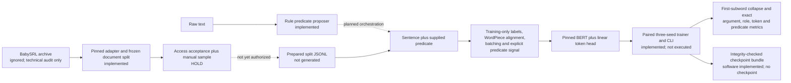

# Semantic Action Extractor

## TL;DR

This project extracts source-grounded actions from English text and studies a
narrower research task: given a sentence and one supplied verbal predicate,
predict one word-level PropBank BIO label per word.

The repository now contains the complete, reproducible software path for that
controlled SRL experiment: strict dataset I/O, a training-only label
vocabulary, WordPiece alignment and first-subword prediction collapse,
predicate-conditioned BERT construction with immutable model revisions,
padding and overlength accounting, exact argument/per-role/token/predicate
evaluation, run provenance, integrity-checked checkpoints, and a paired
three-seed training engine and command-line runner with constant learning rate
after optional warmup.

It does **not** contain a prepared research dataset, trained checkpoint, or
model-quality result. MASC was rejected. BabySRL passed the technical
representability gate, but TalkBank registration/current-rules acceptance and
an authorized manual conversion sample remain on hold. Access confirmation is
required before provisional ignored preparation; training additionally
requires the private raw-versus-BIO review to pass.

## What the project measures

The controlled research contract is:

```text
(sentence words, supplied predicate index) -> one PropBank BIO tag per word
```

The raw-text product contract is broader:

```text
raw text -> predicate candidates -> supplied-predicate SRL -> optional action records
```

These are separate claims. A supplied-predicate SRL score does not measure
whether a raw-text system found the correct predicate, and candidate detection
cannot be credited for downstream argument labeling.

## Example product output

This invented example demonstrates the runnable rule baseline; it is not a
corpus excerpt or neural-model result.

Input:

```text
Maya emailed the signed contract to Jordan on Tuesday.
```

Abridged output:

```json
{
  "actions": [
    {
      "actor": {"text": "Maya", "start": 0, "end": 4},
      "predicate": {"text": "emailed", "start": 5, "end": 12},
      "predicate_lemma": "email",
      "patient": {"text": "the signed contract", "start": 13, "end": 32},
      "qualifiers": [
        {"relation": "to", "value": {"text": "Jordan", "start": 36, "end": 42}},
        {"relation": "on", "value": {"text": "Tuesday", "start": 46, "end": 53}}
      ]
    }
  ]
}
```

The action view is deliberately separate from the neural PropBank output.
`ARG0` and `ARG1` are predicate- and sense-relative roles, not universal
synonyms for actor and patient.

## System status



Implemented software and current evidence are intentionally distinguished:

| Boundary | Repository status | Empirical status |
| --- | --- | --- |
| Rule action extractor | API and CLI implemented | No corpus-quality or systems benchmark |
| Prepared dataset contract | Canonical three-split JSONL, manifest fingerprints, exact duplicate/leakage checks | No prepared BabySRL files written |
| Label and alignment boundary | Train-only immutable vocabulary, BIO/WordPiece alignment, first-subword collapse | Synthetic tests only |
| Model boundary | Full-fine-tuning BERT plus linear head; model and tokenizer revisions must be pinned by experiment config | Synthetic pinned-model forward/backward smoke passed on MPS; no corpus training run |
| Evaluation | Exact micro argument span P/R/F1, per-role metrics, token accuracy, and supplied-predicate diagnostics | No development or test score |
| Training and ablation | Paired three-seed engine and strict CLI; constant LR after warmup | Not executed |
| Systems measurement | Canonical aggregate p50/p95, throughput, peak-memory, and checkpoint-size contract with private injected runner | No trained checkpoint to benchmark |
| Provenance and checkpoints | Canonical configuration/run metadata and SHA-256 validation of serialized state | No checkpoint exists; redistribution remains on hold |

## Data reconciliation

### Rejected: MASC PropBank

The [MASC PropBank release](https://anc.org/data/masc/downloads/data-download/)
was rejected for the fixed gold-span milestone. In the strict diagnostic slice,
unlinked trace-only arguments cap optimistic exact-span recovery at 93.25%,
below the predeclared 99% gate. The archive remains ignored audit evidence; it
was never prepared or used for training. See the
[MASC audit](reports/masc_propbank_audit.md).

### Technical pass, access hold: BabySRL

[BabySRL](https://talkbank.org/childes/access/Derived/BabySRL.html) is a derived
version of the CHILDES Brown corpus containing PropBank-style verbal role
annotations for selected parental utterances. Its
[format description](https://cogcomp.seas.upenn.edu/Data/BabySRL.html)
documents surface role spans in CHAT files, which match the project's supplied-
predicate BIO target.

The pinned, read-only structural audit reports:

| Item | Frozen value |
| --- | ---: |
| CHAT documents | 133 |
| Declared proposition columns | 18,536 |
| Losslessly converted | 18,397 |
| Fail-closed rejections | 139 |
| Conversion coverage | 99.2501% |
| Final eligible train examples | 13,713 |
| Final eligible development examples | 1,356 |
| Final eligible test examples | 1,274 |

The child-stratified 133-document assignment is frozen in
[`docs/datasets/babysrl_split_manifest.json`](docs/datasets/babysrl_split_manifest.json)
with canonical SHA-256
`73ecae9f81d1d2b9f8495b13b297da9c3d24e387630e71a38ef2420d4c9a5de7`.
Exact sentence sequences crossing split boundaries are excluded from every
affected split; development and test then remove repeated identical semantic
examples. Documents are never moved after the freeze.

This is a structural feasibility result, not permission and not model quality.
The [CHILDES access page](https://talkbank.org/childes/access.html) and current
[TalkBank ground rules](https://talkbank.org/0share/rules.html) govern access
and use. Registration/rules acceptance and an authorized privacy-preserving
manual sample are still required. No prepared data, training run, result, or
checkpoint exists. Once access is confirmed, a provisional ignored prepared
dataset may be created solely so the private raw-versus-BIO review can run;
training remains blocked until that review passes. Checkpoint redistribution
is a separate hold. CourseWorks and Columbia course data are not used in this
project.

## Evaluation contract

The primary neural metric is micro-averaged exact labeled argument-span
precision, recall, and F1 over word-level BIO predictions. Predicate `V` and
`C-V` spans are excluded because the predicate is supplied. The evaluator also
reports per-role P/R/F1, repaired prediction tags, token accuracy, correct or
missing predicate anchors, spurious predicate labels, and predicted argument
spans overlapping the predicate.

Candidate-predicate recall and any raw-text end-to-end frame score remain
separate future evaluations. Token accuracy is diagnostic because frequent
`O` labels can conceal poor argument extraction.

## Research plan

| Study | Purpose | Status |
| --- | --- | --- |
| E0 — rule baseline | Runnable, source-grounded product interface and predicate proposer | Software implemented; quality and systems results pending |
| E1 — SRL/data foundation | Fixed BIO contract, data gates, adapter, splits, leakage controls, evaluation, provenance | Software and aggregate BabySRL audit implemented; access acceptance and manual sample on hold |
| E2 — neural reproduction | Fine-tune the predicate-conditioned BERT model on the frozen prepared split | Not run; prepared data does not exist |
| E3 — bounded ablation | Compare predicate signal with an otherwise identical no-signal run over three paired seeds | Engine and CLI implemented; experiments not run |
| E4 — analysis | Report errors, latency, throughput, memory, artifact size, and limitations | Aggregate benchmark contract implemented; real measurements not run |

## Scope and limitations

- BabySRL contains child-directed parental speech, so results would not imply
  operational-domain readiness.
- BabySRL CHAT does not provide verified predicate sense IDs; the adapter
  records an explicit unknown-sense suffix rather than inventing senses.
- The controlled model assumes a supplied verbal predicate. Raw-text predicate
  discovery is a separate error source.
- The system does not resolve implicit arguments, coreference, intent, task
  ownership, completion state, or legal/business meaning.
- The rule baseline is English-specific and works best on short active clauses.
- A future run would fine-tune a pretrained encoder; this project does not
  pretrain a foundation model.
- No trained checkpoint may be published until its separate redistribution,
  license, privacy, leakage, and model-card review is complete.

## Documentation

- [PROJECT_SPEC.md](PROJECT_SPEC.md) defines the research question, experiments,
  controls, and definition of done.
- [DATA_USAGE.md](DATA_USAGE.md) records the data and publication boundary.
- [MODEL_CARD.md](MODEL_CARD.md) documents implemented and untrained components.
- [reports/babysrl_audit.md](reports/babysrl_audit.md) records the structural
  BabySRL pass and remaining holds.
- [docs/datasets/babysrl_manual_review.md](docs/datasets/babysrl_manual_review.md)
  defines the private raw-versus-BIO review required before training.
- [reports/results.md](reports/results.md) keeps future model results blank.
- [reports/error_analysis.md](reports/error_analysis.md) preregisters analysis
  categories without claiming observations.

## Run the implemented software

Python 3.11 or newer is required.

Install and run the dependency-free rule baseline:

```bash
python -m pip install -e .
semantic-action-extractor --pretty "Maya emailed the signed contract to Jordan on Tuesday."
```

Run the dependency-free test suite:

```bash
PYTHONPATH=src python -m unittest discover -s tests -v
```

With the exact ignored archive present, the BabySRL command can reproduce the
aggregate audit without writing prepared data:

```bash
PYTHONPATH=src python -m semantic_action_extractor.srl.babysrl \
  data/raw/BabySRL.zip
```

Do not pass a preparation output directory until registration and current-rules
acceptance are confirmed. The resulting ignored dataset is provisional until
the private manual review passes and cannot be used for training before then.
The review command and decision format are documented in the private
[BabySRL manual-review workflow](docs/datasets/babysrl_manual_review.md); it
prints aggregate receipts only and keeps review items under ignored
`data/review/`.

The paired training command is implemented, but the placeholders below cannot
become valid frozen configurations until an authorized prepared-data
fingerprint exists:

```bash
semantic-action-train-srl \
  --predicate-config path/to/predicate_signal.toml \
  --ablation-config path/to/no_predicate_signal.toml \
  --dataset path/to/ignored/prepared-dataset \
  --output-root path/to/new/ignored/run-directory \
  --git-revision 40-character-lowercase-commit
```

The command requires strict paired configurations, an exact prepared-data
fingerprint match, a new Git-ignored output directory, and an exact Git commit.
It stages six seed/variant runs, preserves a machine-readable partial failure
record if a run stops, and atomically publishes the complete paired result.

After a checkpoint exists, the real benchmark command validates its metadata,
labels, state digest, config, and dataset before loading it. It measures fixed
single-example and eight-example batches and writes only canonical aggregates:

```bash
semantic-action-benchmark-srl \
  --config path/to/exact-variant.toml \
  --dataset path/to/ignored/prepared-dataset \
  --checkpoint path/to/checkpoint-bundle \
  --output path/to/new/ignored/benchmark.json
```

CUDA reports a resettable allocator peak. CPU and MPS report process-lifetime
peak RSS, including model load, because MPS has no resettable peak-memory
counter. The result records that method explicitly.

## License

Original repository code is MIT licensed. That license does not apply to
datasets, pretrained models, or checkpoints. Raw and prepared corpora remain
outside Git, and checkpoint redistribution is currently on hold.
