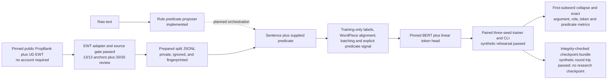

# Semantic Action Extractor

## TL;DR

This project extracts source-grounded actions from English text and studies a
narrower research task: given a sentence and one supplied verbal predicate,
predict one word-level PropBank BIO label per word.

The repository now contains the complete, reproducible software path for that
controlled SRL experiment: strict dataset I/O, a training-only label
vocabulary, WordPiece alignment and first-subword prediction collapse,
predicate-conditioned BERT construction with immutable model revisions,
padding and overlength accounting, exact argument/per-role/token/predicate
evaluation, run provenance, integrity-checked checkpoints, and a paired
three-seed training engine with a verified exact-match resume path, per-output
nonblocking locking, and constant learning rate after optional warmup.

The tracked repository contains no raw or prepared corpus, research-trained
checkpoint, or model-quality result. A private Git-ignored EWT dataset is now
prepared locally, and one full batch-32 forward/backward/optimizer step on the
actual prepared data passed on Apple MPS. A separate complete six-run rehearsal
on invented data also passed, including checkpoint reload and aggregate
benchmark execution; those synthetic artifacts and scores are not portfolio
results. MASC was rejected. The selected no-registration route joins pinned
public PropBank EWT gold skeletons to pinned public UD English EWT r2.2 words.
Its adapter, fail-closed gate, and leakage controls are implemented and pass.
The [aggregate-only private source review](reports/ewt_private_source_review.md)
inspected all 13 predicate-anchor divergences, the one token-width mismatch,
and 30/30 deterministically selected aligned records. Private preparation and
the real-data MPS preflight are complete; the six-run research training study
has not run.

## What the project measures

The controlled research contract is:

```text
(sentence words, supplied predicate index) -> one PropBank BIO tag per word
```

The raw-text product contract is broader:

```text
raw text -> predicate candidates -> supplied-predicate SRL -> optional action records
```

These are separate claims. A supplied-predicate SRL score does not measure
whether a raw-text system found the correct predicate, and candidate detection
cannot be credited for downstream argument labeling.

## Example product output

This invented example demonstrates the runnable rule baseline; it is not a
corpus excerpt or neural-model result.

Input:

```text
Maya emailed the signed contract to Jordan on Tuesday.
```

Abridged output:

```json
{
  "actions": [
    {
      "actor": {"text": "Maya", "start": 0, "end": 4},
      "predicate": {"text": "emailed", "start": 5, "end": 12},
      "predicate_lemma": "email",
      "patient": {"text": "the signed contract", "start": 13, "end": 32},
      "qualifiers": [
        {"relation": "to", "value": {"text": "Jordan", "start": 36, "end": 42}},
        {"relation": "on", "value": {"text": "Tuesday", "start": 46, "end": 53}}
      ]
    }
  ]
}
```

The action view is deliberately separate from the neural PropBank output.
`ARG0` and `ARG1` are predicate- and sense-relative roles, not universal
synonyms for actor and patient.

## System status



Implemented software and current evidence are intentionally distinguished:

| Boundary | Repository status | Empirical status |
| --- | --- | --- |
| Rule action extractor | API and CLI implemented | No corpus-quality or systems benchmark |
| Prepared dataset contract | Canonical three-split JSONL, manifest fingerprints, exact duplicate/leakage checks | Private ignored EWT preparation completed: 31,101/3,775/3,610 examples; fingerprint `2eb2f0e2…b66e1b` |
| Label and alignment boundary | Train-only immutable vocabulary, BIO/WordPiece alignment, first-subword collapse | Synthetic tests and invented-data rehearsal passed |
| Model boundary | Full-fine-tuning BERT plus linear head; model and tokenizer revisions pinned in frozen paired configs | Actual prepared-data batch-32 optimizer-step preflight passed on MPS; no research-corpus training run |
| Evaluation | Exact micro argument span P/R/F1, per-role metrics, token accuracy, and supplied-predicate diagnostics | No development or test score |
| Training and ablation | Paired three-seed engine and strict CLI; exact-match resume, per-output nonblocking lock, and constant LR after warmup | All six seed/variant runs completed on invented data and the recovery boundary passed independent fault-injection review; research experiment not run |
| Systems measurement | Canonical aggregate p50/p95, throughput, peak-memory, and checkpoint-size contract | Both invented-data variant checkpoints completed the real benchmark path; no research measurements |
| Provenance and checkpoints | Canonical configuration/run metadata, complete run journal, and SHA-256 validation of serialized state | Synthetic checkpoint save/verify/reload and interrupted-write recovery passed; no research checkpoint and redistribution remains on hold |

## Data reconciliation

### Rejected: MASC PropBank

The [MASC PropBank release](https://anc.org/data/masc/downloads/data-download/)
was rejected for the fixed gold-span milestone. In the strict diagnostic slice,
unlinked trace-only arguments cap optimistic exact-span recovery at 93.25%,
below the predeclared 99% gate. The archive remains ignored audit evidence; it
was never prepared or used for training. See the
[MASC audit](reports/masc_propbank_audit.md).

### Selected: PropBank EWT skeletons plus UD English EWT r2.2

The selected source pairs the pinned [PropBank release](https://github.com/propbank/propbank-release/tree/4abade0b53ce4a181e1d98b3518101c1a44d395a)
gold skeletons with the pinned [UD English EWT r2.2 release](https://github.com/UniversalDependencies/UD_English-EWT/tree/6e064999a75b9c941c515ce1be98352e6f9831e0).
The implemented `semantic-action-prepare-ewt` adapter verifies both Git
revisions and relevant worktrees, joins normalized document identities and
sentence positions, reconstructs exact PropBank span columns, and fails closed
on structural drift.

The aggregate gate reports:

| Stage | Train | Development | Test | Total |
| --- | ---: | ---: | ---: | ---: |
| Structurally valid verbal predicates | — | — | — | 38,639 |
| Word-aligned after one four-predicate sentence exclusion | 31,174 | 3,806 | 3,655 | 38,635 |
| Prepared eligible after leakage, conflict, and eval-dedup controls | 31,101 | 3,775 | 3,610 | 38,486 |
| Modeled at `max_length=128` | 31,039 | 3,775 | 3,610 | 38,424 |

The pinned tokenizer preflight builds a train-derived vocabulary of 111 labels,
including `O` and continuation closure, with no development or test label
outside it. The private ignored preparation reproduces these counts at dataset
fingerprint
`2eb2f0e20bfa5e3521faba9521b329a0c43dcc63eb523a359e79337c04b66e1b`;
the [preparation record](reports/ewt_preparation.md) retains its split-file and
provenance SHA-256 values. These are data artifacts and pre-outcome checks, not
model results. The private aggregate-only source review checked all 13
metadata-versus-primary predicate-anchor divergences, the one token-width
mismatch, and 30/30 deterministically selected aligned verbal records. No
account, registration, CourseWorks login, LDC download, or user-supplied corpus
file is required.

The frozen predicate-signal configuration also completed one full batch-32
forward/backward, gradient-clipping, AdamW, and scheduler step on the actual
prepared data at the longest retained sequence length of 118. It passed on MPS
in 3.0069 seconds with 3,211,741,952 allocated bytes. This is a fit preflight,
not a training run, score, or systems benchmark.

This is a validated inferred cross-release join, not PropBank's prescribed LDC
mapping. UD licenses its annotations and database while expressly noting
separate copyrights in the underlying text. Raw sources, reconstructed and
prepared data, and future trained weights therefore remain ignored and private;
only source-neutral code and non-reconstructive aggregate metrics are public
pending a separate weights review. See the [EWT gate](docs/datasets/ewt_propbank_gate.md)
and [audit](reports/ewt_propbank_audit.md).

### Audited fallback only: BabySRL

[BabySRL](https://talkbank.org/childes/access/Derived/BabySRL.html) is a derived
version of the CHILDES Brown corpus containing PropBank-style verbal role
annotations for selected parental utterances. Its
[format description](https://cogcomp.seas.upenn.edu/Data/BabySRL.html)
documents surface role spans in CHAT files, which match the project's supplied-
predicate BIO target.

The pinned, read-only structural audit reports:

| Item | Frozen value |
| --- | ---: |
| CHAT documents | 133 |
| Declared proposition columns | 18,536 |
| Losslessly converted | 18,397 |
| Fail-closed rejections | 139 |
| Conversion coverage | 99.2501% |
| Final eligible train examples | 13,713 |
| Final eligible development examples | 1,356 |
| Final eligible test examples | 1,274 |

The child-stratified 133-document assignment is frozen in
[`docs/datasets/babysrl_split_manifest.json`](docs/datasets/babysrl_split_manifest.json)
with canonical SHA-256
`73ecae9f81d1d2b9f8495b13b297da9c3d24e387630e71a38ef2420d4c9a5de7`.
Exact sentence sequences crossing split boundaries are excluded from every
affected split; development and test then remove repeated identical semantic
examples. Documents are never moved after the freeze.

This remains a historical structural-feasibility result, not permission or
model quality. BabySRL is no longer the active path. Its TalkBank registration,
rules, and manual-review gates would apply only if the public EWT route later
failed and this fallback were explicitly activated. No BabySRL data was
prepared or used for training.

## Evaluation contract

The primary neural metric is micro-averaged exact labeled argument-span
precision, recall, and F1 over word-level BIO predictions. Predicate `V` and
`C-V` spans are excluded because the predicate is supplied. The evaluator also
reports per-role P/R/F1, repaired prediction tags, token accuracy, correct or
missing predicate anchors, spurious predicate labels, and predicted argument
spans overlapping the predicate.

Candidate-predicate recall and any raw-text end-to-end frame score remain
separate future evaluations. Token accuracy is diagnostic because frequent
`O` labels can conceal poor argument extraction.

## Research plan

| Study | Purpose | Status |
| --- | --- | --- |
| E0 — rule baseline | Runnable, source-grounded product interface and predicate proposer | Software implemented; quality and systems results pending |
| E1 — SRL/data foundation | Fixed BIO contract, data gates, adapter, splits, leakage controls, evaluation, provenance | Complete: selected EWT gate/review pass and private ignored preparation is fingerprinted at `2eb2f0e2…b66e1b` |
| E2 — neural reproduction | Fine-tune the predicate-conditioned BERT model on the frozen prepared split | Paired configs frozen and real-data batch-32 MPS optimizer-step preflight passed; six-run research training awaits reliable power |
| E3 — bounded ablation | Compare predicate signal with an otherwise identical no-signal run over three paired seeds | Six-run invented-data rehearsal passed; research experiment not run |
| E4 — analysis | Report errors, latency, throughput, memory, artifact size, and limitations | Both synthetic checkpoint variants completed aggregate benchmarking; research measurements not run |

## Scope and limitations

- EWT contains web genres including blogs, email, reviews, social material, and
  answers; results would not imply operational-domain readiness.
- The selected words-to-skeleton pairing is a validated inferred join across
  public releases, not the official LDC reconstruction prescribed by PropBank.
- The controlled model assumes a supplied verbal predicate. Raw-text predicate
  discovery is a separate error source.
- The system does not resolve implicit arguments, coreference, intent, task
  ownership, completion state, or legal/business meaning.
- The rule baseline is English-specific and works best on short active clauses.
- A future run would fine-tune a pretrained encoder; this project does not
  pretrain a foundation model.
- No trained checkpoint may be published until its separate redistribution,
  license, privacy, leakage, and model-card review is complete.

## Documentation

- [PROJECT_SPEC.md](PROJECT_SPEC.md) defines the research question, experiments,
  controls, and definition of done.
- [DATA_USAGE.md](DATA_USAGE.md) records the data and publication boundary.
- [MODEL_CARD.md](MODEL_CARD.md) documents implemented and untrained components.
- [docs/datasets/ewt_propbank_gate.md](docs/datasets/ewt_propbank_gate.md) records
  the selected no-registration route and publication boundary.
- [reports/ewt_propbank_audit.md](reports/ewt_propbank_audit.md) records the
  aggregate EWT alignment, conversion, split, and preflight evidence.
- [reports/ewt_private_source_review.md](reports/ewt_private_source_review.md)
  records the non-reconstructive aggregate result of the private source review.
- [reports/ewt_preparation.md](reports/ewt_preparation.md) records the private
  preparation fingerprints, frozen configs, and real-data MPS preflight using
  aggregate-only evidence.
- [reports/babysrl_audit.md](reports/babysrl_audit.md) preserves BabySRL's
  historical structural pass as fallback evidence.
- [reports/neural_runtime_smoke.md](reports/neural_runtime_smoke.md) records the
  six-run invented-data rehearsal without promoting synthetic scores.
- [reports/results.md](reports/results.md) keeps future model results blank.
- [reports/error_analysis.md](reports/error_analysis.md) preregisters analysis
  categories without claiming observations.

## Run the implemented software

Python 3.11 or newer is required.

Install and run the dependency-free rule baseline:

```bash
python -m pip install -e .
semantic-action-extractor --pretty "Maya emailed the signed contract to Jordan on Tuesday."
```

Run the dependency-free test suite:

```bash
PYTHONPATH=src python -m unittest discover -s tests -v
```

With both exact ignored public checkouts present, the EWT command can reproduce
the aggregate gate without writing prepared data:

```bash
semantic-action-prepare-ewt \
  data/raw/ewt_sources/propbank-release \
  data/raw/ewt_sources/UD_English-EWT
```

No account or manual user review is required. The first real private
preparation has now completed with
`--output-directory data/processed/ewt-span-srl-v1`.
Its canonical splits, manifest, and EWT provenance remain inside the ignored
data boundary. The resulting fingerprint is
`2eb2f0e20bfa5e3521faba9521b329a0c43dcc63eb523a359e79337c04b66e1b`;
see the [aggregate-only preparation record](reports/ewt_preparation.md).

The tracked paired configurations are now frozen against that fingerprint:
`configs/ewt_predicate_signal.toml` has digest
`9bf8cd7c7a839bd9bfb6b39fde616f7e6f42d2ef163ea5f47b7afeeee1120bdc`,
and `configs/ewt_no_predicate_signal.toml` has digest
`19ff94ff8bf839ee2fd5ebdab8ffed24b1ad7b243cc413a2ba687262f8f9d866`.
The future training command is:

```bash
semantic-action-train-srl \
  --predicate-config configs/ewt_predicate_signal.toml \
  --ablation-config configs/ewt_no_predicate_signal.toml \
  --dataset data/processed/ewt-span-srl-v1 \
  --output-root runs/ewt-paired-v1 \
  --git-revision 40-character-lowercase-commit
```

The command requires strict paired configurations, an exact prepared-data
fingerprint match, a new Git-ignored output directory, and an exact Git commit.
It stages six seed/variant runs, preserves a machine-readable partial failure
record if a run stops, retains a canonical journal after completion, and
atomically publishes the complete paired result. A per-output nonblocking lock
rejects a concurrent writer.

After an interruption, rerun the identical command with only `--resume` added:

```bash
semantic-action-train-srl \
  --predicate-config configs/ewt_predicate_signal.toml \
  --ablation-config configs/ewt_no_predicate_signal.toml \
  --dataset data/processed/ewt-span-srl-v1 \
  --output-root runs/ewt-paired-v1 \
  --git-revision the-same-40-character-lowercase-commit \
  --resume
```

Resume is fail-closed. It requires the identical partial-run destination,
provenance, paired configurations, prepared dataset and fingerprint, Git
revision, and runtime identity. Before reusing work it validates each completed
result/checkpoint pair and each completed predicate/no-predicate seed pair. It
recovers only exact writer-owned interrupted atomic writes, next-checkpoint
staging, and checkpoint-tombstone cleanup; lookalike or unknown artifacts are
rejected rather than removed. These verified durability controls and the
single real-data optimizer-step preflight do not imply that the six-run
research training study has run.

After a checkpoint exists, the real benchmark command validates its metadata,
labels, state digest, config, and dataset before loading it. It measures fixed
single-example and eight-example batches and writes only canonical aggregates:

```bash
semantic-action-benchmark-srl \
  --config path/to/exact-variant.toml \
  --dataset data/processed/ewt-span-srl-v1 \
  --checkpoint path/to/checkpoint-bundle \
  --output path/to/new/ignored/benchmark.json
```

CUDA reports a resettable allocator peak. CPU and MPS report process-lifetime
peak RSS, including model load, because MPS has no resettable peak-memory
counter. The result records that method explicitly.

## License

Original repository code is MIT licensed. That license does not apply to
datasets, pretrained models, or checkpoints. Raw and prepared corpora remain
outside Git, and checkpoint redistribution is currently on hold.
